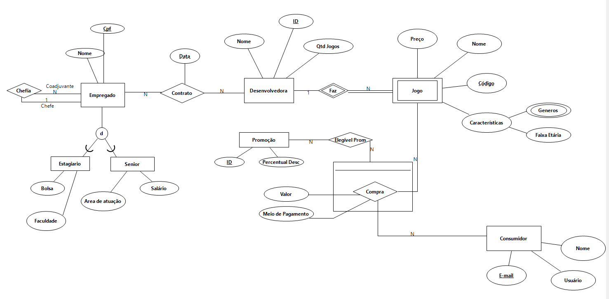

<html>
  <body>
    <header>
      <h1>GDI_projeto2020.2</h1>
    </header>
    <h2>Integrantes:</h2>
    
 Bianca Carneiro da Cunha Nunes Ferreira (<a href="mailto:bccnf@cin.ufpe.br">bccnf@cin.ufpe.br</a>) 
      Caio de Mendonça Barbosa (<a href="mailto:cmb2@cin.ufpe.br">cmb2@cin.ufpe.br</a>) 
      Rodrigo Abreu Alves de Freitas Mota ( <a href="mailto:raafm@cin.ufpe.br">raafm@cin.ufpe.br</a>) 
      Elisson Rodrigo da Silva Araujo ( <a href="mailto:ersa@cin.ufpe.br">ersa@cin.ufpe.br</a>) 
      André Arraes de Alencar Valença ( <a href="mailto:aaav@cin.ufpe.br">aaav@cin.ufpe.br</a>) 
      Pedro Henrique Sarmento de Paula ( <a href="mailto:phsp@cin.ufpe.br">phsp@cin.ufpe.br</a>) 
    

    
  </body>
</html>
